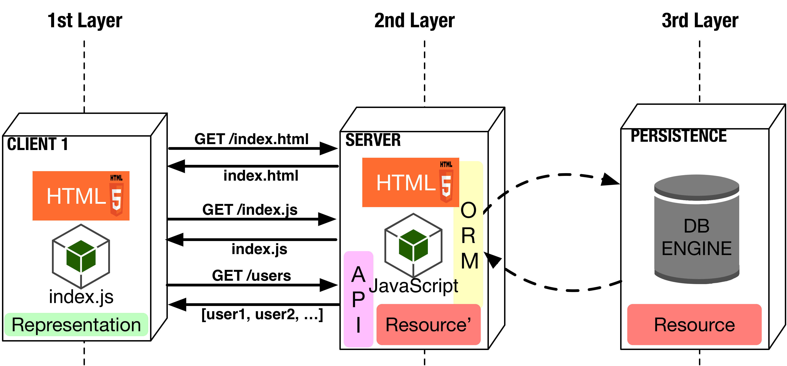

# Code On Demand (COD)

este codigo no esta permitido copiarlo para el trabajo de chat web, no doy mi concentimento y aviso a mis compañeros que no copien el codigo que tengo 

( atentamente julio bonifaz)

> The optional Code on Demand constraint allows clients to **request and execute code from servers**. This, in turn, allows the servers to **deploy new features to clients**. 

Adding this constraint allows  our web application to: 
* Server can temporarily extend the client.
* Transfer logic to the client.
* Client executes logic.

## Examples:
* JavaScript
* Applets

## Diagram Architecture:


## Advantages
* Ability to add features to a deployed client.
* Provides for improved extensibility and configurability, and better user-perceived performance and efficiency.
* Scalability of the server is improved, since it can off-load work to the client that would otherwise have consumed its resources.

## Disadvantages
* Using code-on-demand reduces visibility

 
## CODE Explanation
#### Add the script reference in HTML file

``` html
<head>
    <meta charset="UTF-8">
    <title>Chat Login</title>
    <script src="https://ajax.googleapis.com/ajax/libs/jquery/3.1.0/jquery.min.js"></script>
    <script src="login.js"></script>
</head>
```

#### Link the button event with a JS function 
``` html
<input type="button" value="login" onclick="getData()"/>
```

#### Create getData function
``` javascript
function getData(){
        $('#action').html("Authenticating...");
        var username = $('#username').val();
        var password = $('#password').val();
        var message = JSON.stringify({
                "username": username,
                "password": password
            });

        $.ajax({
            url:'/authenticate',
            type:'POST',
            contentType: 'application/json',
            data : message,
            dataType:'json',
            success: function(response){
                //alert(JSON.stringify(response));
                $('#action').html(response['statusText']);
            },
            error: function(response){
                //alert(JSON.stringify(response));
                $('#action').html(response['statusText']);
            }
        });
    }
```


#### Modify authenticate backend method
``` python
def authenticate():
    #1. Collect data from request message
    message = json.loads(request.data)
    username = message['username']
    password = message['password']
    #2. Look in database if a user exists
    db_session = db.getSession(engine)
    try:
        user = db_session.query(entities.User
            ).filter(entities.User.username == username
            ).filter(entities.User.password == password
            ).one()
        #3a. Return an authorized message to client
        message = {'message': 'Authorized'}
        return Response(message, status=200, mimetype='application/json')
    except Exception:
        #3b. Return an unauthorized message to client
        message = {'message': 'Unauthorized'}
        return Response(message, status=401, mimetype='application/json')

```

## TODO
* Add CSS Style to Login
* Modify ```getData() ``` function to instead a text show a wheel image while loading.
* Create chat.html and chat.js to allow users send a receive messages.

## Referencias.
1.  [https://www.ics.uci.edu/~fielding/pubs/dissertation/rest_arch_style.htm]
2.  [https://en.wikipedia.org/wiki/Create,_read,_update_and_delete]
3.  [https://www.mulesoft.com/resources/api/what-is-an-api]
4.  [https://github.com/cs2b01/uniform-interface/blob/master/ebook-UndisturbedREST_v1.pdf]
### Install SQLAlchemy
```
pip install sqlAlchemy
pip3 install sqlAlchemy
```
